# Setup and lesson workflow

See [storage](storage.md), [record contract](records.md), and [curriculum](curriculum.md).

## State transitions

```mermaid
stateDiagram-v2
    [*] --> Linked: user links existing folder
    Linked --> Setup: first setup requested / no completion marker
    Linked --> Lesson: lesson requested / setup complete
    Setup --> Goal: new dated setup log
    Goal --> Probe: goal and useful context collected
    Probe --> Probe: one answer informs next question
    Probe --> SetupReview: enough evidence for starting point
    SetupReview --> SetupFinalize: reveal all results and propose target
    SetupFinalize --> Linked: required files saved; mark setup complete
    Lesson --> Material: create new dated lesson log; publish full lesson
    Material --> Material: questions and clarification
    Material --> Evaluation: user explicitly chooses questions
    Evaluation --> Evaluation: one answer informs next question
    Evaluation --> LessonReview: enough evidence or clear remaining gap
    LessonReview --> FinalQA: reveal all results
    FinalQA --> FinalQA: ask about material; no surprise questions
    FinalQA --> Evaluation: choose new round with different questions
    FinalQA --> Finalize: user chooses finish
    Finalize --> Linked: required files saved; mark complete and unlink log
    Setup --> Interrupted: process terminated
    Probe --> Interrupted: process terminated
    Lesson --> Interrupted: process terminated
    Material --> Interrupted: process terminated
    Evaluation --> Interrupted: process terminated
    FinalQA --> Interrupted: process terminated
    Finalize --> Interrupted: process terminated
    Interrupted --> Linked: next trigger starts a NEW log; no resume
```

A transition that needs agent work may show a processing state; it does not need to display a choice until work finishes. The normal interactive path is guided by terminal selections/text input rather than returning to the main prompt between stages. Forced termination remains possible; never invent an ending for a partial file.

## Setup: one time per linked folder

1. The user creates an empty Obsidian folder and links it through the folder extension. Linking alone does **not** complete setup. Reject setup without a link before writing anything. A completed folder rejects repeated setup and points to lesson sessions. There is no reassess/reset; starting over requires a new linked folder. An incomplete old log remains untouched; a new trigger starts a new log, not a resume.
2. Ask the nearest goal, then only useful follow-ups about its purpose and context (travel, work, reading, a test, etc.). Accept an unknown long-term goal. Self-reported experience helps choose an initial probe but is not evidence of proficiency.
3. Run a **broad adaptive initial assessment**, one question per turn. Survey text-assessable strands—script reading, vocabulary, particles/structure, verb and adjective forms, short-text comprehension, and independent production/application—before narrowing uncertainty. Use each response privately to adjust difficulty or inspect prerequisites; distinguish recognition from production and sample more than one function/context per relevant strand. A gap in one expression is **not** a stopping signal or permission to ask the remaining questions only about it. The UI permits `I don't know` and written answers where appropriate. Log visible questions and answers immediately, but **withhold all judgments, keys, and explanations until the entire assessment ends**. There is no fixed question count or time limit: stop when a provisional floor and next boundary are supportable across assessable strands, important competing first targets can be compared, and further questions would not materially change the initial map. Listening and speaking not tested through text stay unknown; never infer an official level.
4. Reveal the complete assessment review by strand and aspect, including uncertainty and why the chosen first target wins over other plausible gaps. The user may volunteer corrections to goals or circumstances; do not ask them to approve the diagnosis. Save reviewed evidence, a small expandable curriculum map, initial progress, and a dated setup log. Use the guarded study file tools for setup writes, then call `complete_setup` to validate the required files and create the marker last. Do **not** start the first lesson or create a permanent material page during setup.

## One guided lesson session

- **Start:** only on an explicit trigger. Read the linked folder's goals, map, progress, and relevant prior evidence. Choose **one main target** and explain why. Create a unique dated Markdown session file, report its Obsidian path, and link the log automatically. An interrupted session never resumes; the next trigger creates a new file.
- **Publish material:** write a complete initial lesson to that file before offering choices. Include the observable goal, relevant prerequisites, rule and usage limits, varied examples, useful contrasts, and sources when actually consulted. Match depth and vocabulary to observed ability. Check genuinely uncertain Japanese when a source is available; otherwise disclose the uncertainty rather than assert it as fact. Writing a lesson does not mean the learner understands it.
- **Learning Q&A:** terminal choices such as `Ask about the material` or `Start questions`. Q&A accepts free text and can repeat without a forced limit. Log questions and clarifications append-only. Only the user's explicit choice enters evaluation.
- **Closed evaluation:** plan target coverage and formats, not a fixed set of questions. Show **one question**, log its answer, interpret it privately, and choose the next. Never display correctness, hints, keys, scores, or solutions during the round, including in the live Obsidian log. There is no pause/Q&A control within a round. Forced exit leaves partial evidence without a mastery claim.
- **Review:** disclose every result, reasoning, valid alternatives, uncertain items, repeated errors, and the implication for the next target. Final Q&A adds **no surprise questions**. Offer `Finish`, `Ask about the material`, or `Try another round`. A new round uses different questions and again withholds results until its own review.
- **Finalize:** `Finish` starts work; it does **not** immediately detach the log. Save reviewed records and progress; update the curriculum, chapter index, and permanent material only when justified. Record success/failure in the still-linked session file. Only after required writes succeed append the completion marker, notify the user, detach, and stop. A failed required write must be reported and must not produce a completed-session claim.

## Question design and interpretation

Three answer interfaces support many tasks: `multiple_choice` (four plain answer texts; the UI adds labels and `I don't know`), `free_text` (written response or `I don't know`), and `sentence_order` (select every fragment, 2–8 total, with Undo/Reset/Submit or `I don't know`). Tasks include choosing grammar or a particle, filling blanks, transforming forms, translating, composing for a situation, repairing an error, contrasting expressions, reading a short passage, and ordering a sentence. Use only the tasks that actually measure the target.

About **ten questions** is a lesson planning target, neither a minimum/maximum nor an automatic 80% pass line. Stop when varied evidence sufficiently supports a conclusion about the current target **or** the limiting difficulty is already clear and more items would not help. Keep the current target central, even when older grammar occurs naturally. If it is wrong, try a different context. Adjust complexity to the learner; do not make a beginner decode an advanced passage just to answer a basic grammar question.

Judge written answers separately for meaning, target form, clearly observed older-skill errors, typing, and ambiguity. An error in the *tested form* is not automatically a typo; an incidental error does not erase success on the target. Accept valid alternatives. Check nuanced/ambiguous cases against credible sources when available; if unresolved, do not count the item against the learner. Reveal judgments only at the round review.

Earlier grammar naturally recurs in new sentences; no scheduling engine, insertion quota, fixed day interval, or HARD/GOOD/EASY control is required. Observe recurring errors when relevant. An old file date alone does not prove forgetting or trigger an unrelated question.

## Setup correction: the agent owns the starting-point decision

This overrides any earlier wording that implies asking the learner to approve the probe diagnosis or first lesson target. After the end-of-probe review, the agent explains its evidence-based starting target and **continues finalizing setup without a confirmation prompt**. The learner may volunteer corrections to their goals or circumstances; they are never asked to verify the agent's question keys, Japanese grammar, assessment accuracy, or curriculum choice. Reasoning and responsible handling of uncertainty are the agent's job. Records should link the selected target to learner evidence and any sources actually consulted, not store a `userConfirmedTarget` flag.
